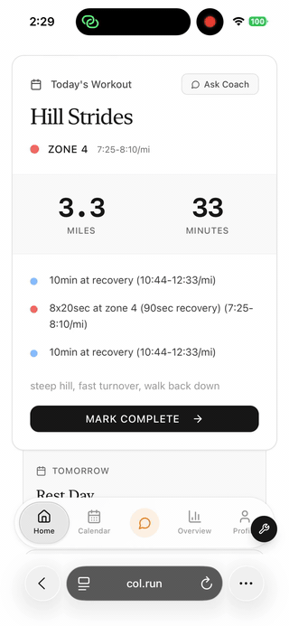

# col.run

An AI running coach. It connects to your Strava, looks at your actual training history, and builds you a running plan that adapts as you go. You can also just chat with it like you would a real coach.

I run a lot and wanted a coach that actually used my own data, so I built one. It's mobile-first, since most of the time you're checking your plan on your phone, not at a computer.

Live at https://col.run

  

## What it does

- Connects to Strava and pulls in your full run history, paces, and zones
- Builds a profile of you as a runner (experience level, weekly mileage, that kind of thing). If your Strava data and your onboarding answers disagree, it trusts the Strava data
- Generates a training plan based on your fitness, your goals, and your longest recent run
- Adapts the plan over time and leaves you a note on each workout
- Lets you chat with the coach. It has tools, so it can actually look at your data and make changes for you during a conversation
- Remembers you between sessions, so it picks up where you left off

## How it works

The coach runs on Claude. There's a tool-use loop so it can pull your workouts, check your plan, and make changes while you're talking to it. I route models to keep it fast and cheap: Opus for the heavier tool loops, Sonnet for normal chat, plus prompt caching.

It keeps a "coach memory" for each athlete so it remembers context across sessions. That part is its own module with unit tests, since it's the kind of thing that's easy to quietly break.

Plans go through a reviewer/fixer step before you ever see them. That caught some real bugs, like a unit mismatch that once 9x'd someone's week 6 mileage.

There's also an eval framework for the coaching notes, so when I change a prompt I can tell if the notes actually got better or worse.

## Stack

Next.js, TypeScript, Firestore, Claude (Anthropic API), Strava API. There's a native iOS app in progress too (Swift).

## Status

Live and in active development. I use it for my own training.
