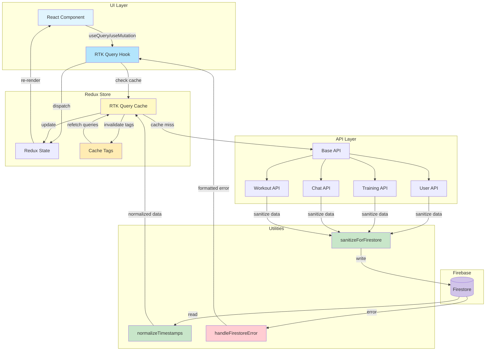

# col.run Data Flow Architecture (for LLM consumption)

## Overview

This document describes the standardized data flow architecture for col.run, which uses Redux Toolkit (RTK) Query for all Firestore operations, providing a consistent, type-safe, and performant data layer.

## Visual Data Flow



## Architecture Components

### 1. RTK Query API Layer (`lib/store/api/`)

The API layer is organized into domain-specific slices:

- **`baseApi.ts`** - Core API configuration and utilities
- **`userApi.ts`** - User profile and authentication operations
- **`trainingApi.ts`** - Training plans and background operations
- **`chatApi.ts`** - Chat history and messaging operations
- **`workoutApi.ts`** - Workout tracking and completion operations

### 2. Type-Safe Utilities

#### Firestore Field Sanitization

```typescript
sanitizeForFirestore<T>(data: T): T
```

- Removes `undefined` values before sending to Firestore
- Recursively processes nested objects and arrays
- Prevents Firestore errors from undefined values

#### Timestamp Normalization

```typescript
normalizeTimestamps<T>(data: T): T
```

- Converts Firestore Timestamps to epoch milliseconds
- Handles Date objects consistently
- Ensures predictable data format in Redux store

#### Error Handling

```typescript
handleFirestoreError(error: unknown, operation: string): never
```

- Standardized error formatting
- Consistent error messages
- Proper error propagation through RTK Query

## Data Flow Patterns

### 1. Query Operations (Reading Data)

```typescript
// Component usage
const { data, isLoading, error } = useGetUserDataQuery(userId);

// Under the hood:
// 1. RTK Query checks cache
// 2. If cache miss or stale, calls queryFn
// 3. queryFn fetches from Firestore
// 4. Data is normalized (timestamps converted)
// 5. Result is cached with tags
// 6. Component receives data
```

### 2. Mutation Operations (Writing Data)

```typescript
// Component usage
const [updateProfile] = useUpdateUserProfileMutation();

// Usage
await updateProfile({
  userId,
  updates: { completedOnboarding: true },
}).unwrap();

// Under the hood:
// 1. Data is sanitized (undefined values removed)
// 2. Firestore document is updated
// 3. Cache tags are invalidated
// 4. Related queries automatically refetch
// 5. UI updates with fresh data
```

### 3. Optimistic Updates

For immediate UI feedback, some mutations include optimistic updates:

```typescript
async onQueryStarted({ userId, updates }, { dispatch, queryFulfilled }) {
  // Immediately update cache
  const patchResult = dispatch(
    userApi.util.updateQueryData('getUserData', userId, (draft) => {
      Object.assign(draft.profile, updates);
    })
  );

  try {
    await queryFulfilled; // Wait for server confirmation
  } catch {
    patchResult.undo(); // Revert on error
  }
}
```

## Cache Management

### Tag System

RTK Query uses tags for intelligent cache invalidation:

- `User` - User-level data changes
- `UserProfile` - Profile-specific changes
- `TrainingBackground` - Training history changes
- `TrainingPlan` - Active plan changes
- `ChatHistory` - Chat message changes
- `WorkoutCompletion` - Workout tracking changes

### Cache Invalidation Flow

```
Update Profile → Invalidates 'User' & 'UserProfile' tags
                ↓
                All queries with these tags refetch
                ↓
                Components re-render with fresh data
```

## Best Practices

### 1. Always Use RTK Query Hooks

❌ **Don't do this:**

```typescript
import { updateUserProfile } from "@/lib/firestore";
await updateUserProfile(userId, data);
```

✅ **Do this:**

```typescript
const [updateProfile] = useUpdateUserProfileMutation();
await updateProfile({ userId, updates: data }).unwrap();
```

### 2. Handle Loading and Error States

```typescript
const { data, isLoading, error } = useGetUserDataQuery(userId);

if (isLoading) return <LoadingSpinner />;
if (error) return <ErrorMessage error={error} />;
if (!data) return <EmptyState />;

return <UserProfile data={data} />;
```

### 3. Use Skip for Conditional Queries

```typescript
const { data } = useGetUserDataQuery(userId, {
  skip: !userId || !isAuthenticated,
});
```

### 4. Leverage Automatic Refetching

```typescript
// After mutation, related queries refetch automatically
const [saveWorkout] = useSaveWorkoutCompletionMutation();

// This will trigger refetch of workout completions
await saveWorkout({ userId, workoutData });
```

## Migration Guide

### Old Pattern (Direct Firestore)

```typescript
// ❌ Old way
import { saveTrainingBackground } from "@/lib/firestore";
await saveTrainingBackground(userId, data);
```

### New Pattern (RTK Query)

```typescript
// ✅ New way
import { useSaveTrainingBackgroundMutation } from "@/lib/store/api";
const [saveBackground] = useSaveTrainingBackgroundMutation();
await saveBackground({ userId, background: data }).unwrap();
```

## Benefits

1. **Automatic Caching** - Reduces unnecessary Firestore reads
2. **Type Safety** - Full TypeScript support throughout
3. **Optimistic Updates** - Instant UI feedback
4. **Error Handling** - Consistent error management
5. **Loading States** - Built-in loading indicators
6. **Cache Invalidation** - Automatic data synchronization
7. **DevTools Support** - Redux DevTools integration

## API Reference

### User Operations

- `useGetUserDataQuery(userId)` - Fetch complete user data
- `useCreateUserProfileMutation()` - Create new user profile
- `useUpdateUserProfileMutation()` - Update user profile
- `useInitializeNewUserMutation()` - Initialize new user

### Training Operations

- `useSaveTrainingBackgroundMutation()` - Save training background
- `useGetLatestTrainingBackgroundQuery(userId)` - Get training background
- `useSaveTrainingPlanMutation()` - Save new training plan
- `useGetActiveTrainingPlanQuery(userId)` - Get active plan
- `useUpdateTrainingPlanMutation()` - Update training plan

### Chat Operations

- `useSaveChatMessageMutation()` - Save chat message
- `useGetChatHistoryQuery({ userId, limit })` - Get chat history
- `useSendChatMessageMutation()` - Send message with LLM response

### Workout Operations

- `useSaveWorkoutCompletionMutation()` - Save workout completion
- `useGetWorkoutCompletionsQuery({ userId, weekNumber })` - Get completions
- `useIsWorkoutCompletedQuery({ userId, workoutDay, weekNumber })` - Check completion

## Debugging

### Redux DevTools

1. Install Redux DevTools browser extension
2. Open DevTools and navigate to Redux tab
3. Monitor:
   - Action dispatches
   - State changes
   - Cache updates
   - API calls

### Common Issues

1. **Cache not updating**: Check tag invalidation
2. **Stale data**: Verify `providesTags` and `invalidatesTags`
3. **Undefined errors**: Ensure `sanitizeForFirestore` is used
4. **Type errors**: Check timestamp normalization

## Future Enhancements

1. **Real-time Subscriptions** - Firestore listener integration
2. **Offline Support** - Cache persistence
3. **Batch Operations** - Multiple document updates
4. **Advanced Caching** - Time-based cache policies
